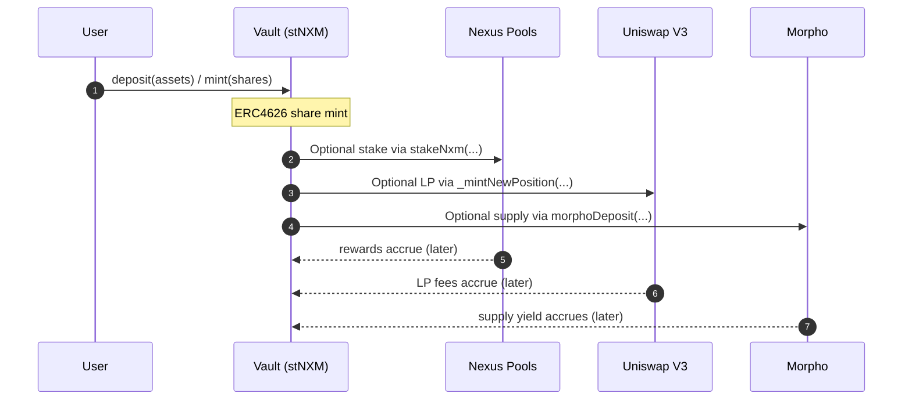
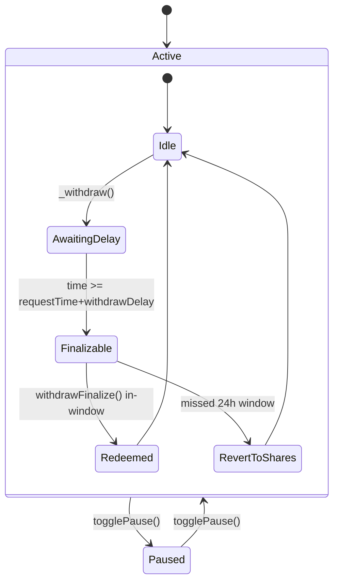

# <h1 align="center"> Hardhat-Foundry Template </h1>

**Template repository for Hardhat and Foundry**

### Getting Started

- Use Foundry:

```bash
forge install
forge test
```

- Use Hardhat:

```bash
npm install
npx hardhat test
```

### Features

- Write / run tests with either Hardhat or Foundry or Both:

```bash
forge test
# or
npx hardhat test
# or
npm test (to run both)
```

- Install libraries with Foundry which work with Hardhat.

```bash
forge install transmissions11/solmate # Already in this repo, just an example
# and
forge remappings > remappings.txt # allows resolve libraries installed with forge or npm
```

Awesome — here’s a **README-style architecture doc** you can drop in as `docs/ARCHITECTURE.md` *or* keep as a second section in your main README. It’s concise, GitHub-friendly, and uses Mermaid diagrams for flows/state.

---

````markdown
# 🧭 stNXM Architecture (README Edition)

This document explains how **stNXM** works under the hood: components, flows, accounting, delays, risks, and the key on-chain APIs.

- [High-Level Design](#high-level-design)
- [Core Components](#core-components)
- [Asset Accounting](#asset-accounting)
- [Lifecycle Flows](#lifecycle-flows)
- [Withdraw Delay & Pause Logic](#withdraw-delay--pause-logic)
- [Integrations](#integrations)
- [Admin & Parameters](#admin--parameters)
- [Events](#events)
- [Developer API (Quick Ref)](#developer-api-quick-ref)
- [Security Considerations](#security-considerations)
- [Testing Checklist](#testing-checklist)

---

## High-Level Design

stNXM is an **ERC4626Upgradeable** vault accepting **wNXM** and minting **stNXM** shares. Capital is allocated across:

- **Nexus Mutual staking pools** (multiple NFTs across tranches),
- **Uniswap V3 LP** in the **stNXM/wNXM** pool,
- **Morpho Blue** supply position (wNXM lent, stNXM as collateral).

Rewards from Nexus + Uniswap + Morpho are **auto-compounded** into the vault. Withdrawals are **delayed** and may be **paused** during claim events.

```mermaid
flowchart LR
    User((User))
    subgraph Vault[stNXM Vault (ERC4626)]
      D[wNXM balance]
      S[Nexus Staking (NFTs, tranches)]
      U[Uniswap V3 LP stNXM/wNXM]
      M[Morpho Blue (supply wNXM)]
    end

    User -- deposit wNXM --> Vault
    Vault --> S
    Vault --> U
    Vault --> M
    S -- rewards --> D
    U -- fees --> D
    M -- yield --> D
    D -- redemption --> User
````

---

## Core Components

| Module                 | Purpose (selected functions)                                                                              |
| ---------------------- | --------------------------------------------------------------------------------------------------------- |
| **ERC4626Upgradeable** | Vault share logic: `deposit`, `mint`, `withdraw`, `redeem`.                                               |
| **Nexus staking**      | Track pool NFTs & tranches: `stakeNxm`, `_withdrawFromPool`, `getRewards`, `resetTranches`, `stakedNxm`.  |
| **Uniswap V3**         | LP via position NFTs: `_mintNewPosition`, `collectDexFees`, `decreaseLiquidity`, `dexBalances`.           |
| **Morpho Blue**        | Lend wNXM using Uniswap TWAP oracle: `morphoDeposit`, `morphoRedeem`, `morphoBalance`.                    |
| **Withdrawal control** | Delay/queue/pause: `_withdraw` (request), `withdrawFinalize`, `maxWithdraw`, `maxRedeem`, `togglePause`.  |
| **Fees & admin**       | Admin fee accrual & payout: `update` (modifier), `getRewards`, `withdrawAdminFees`, `changeAdminPercent`. |

---

## Asset Accounting

**Total assets** are the sum of all productive capital **minus** admin fees:

```solidity
totalAssets() = stakedNxm() + unstakedNxm() - adminFees
```

Where:

* `stakedNxm()` = pro-rata stake across **all pool NFTs & tranches** (handles unexpired & expired tranches).
* `unstakedNxm()` = wallet wNXM + wallet NXM + **Uniswap LP wNXM leg** + **Morpho** supplied assets (converted shares→assets).
* **Admin Fees:** `adminFees` accrue when balance grows (rewards) per `adminPercent`.

**Total supply** excludes “virtual stNXM” minted to the Uniswap pool:

```solidity
totalSupply() = super.totalSupply() - virtualSharesFromDex
```

---

## Lifecycle Flows

### A. Deposit & Allocation



### B. Rewards & Compounding

* `getRewards()`:

  * Iterates all staking NFTs and **withdraws rewards** (and expired stake if chosen elsewhere).
  * Calls `collectDexFees()` to pull Uniswap fees (burns stNXM fee leg; keeps wNXM).
  * Updates `adminFees` on newly realized rewards.
* Rewards sit as **wNXM** and are implicitly reflected in `totalAssets()` → **stNXM exchange rate increases**.

### C. Redemption with Delay

```mermaid
sequenceDiagram
  autonumber
  participant U as User
  participant V as Vault
  U->>V: withdraw()/redeem() → _withdraw
  Note over V: Records WithdrawalRequest{requestTime, assets, shares}<br/>increments `pending` shares
  V-->>U: Emits WithdrawRequested(..., withdrawTime=requestTime+withdrawDelay)
  U->>V: withdrawFinalize(user) (after delay, within +1 day)
  alt On time window
    V->>U: burns shares; transfers wNXM
  else Window missed
    V->>U: returns shares; no payout
  end
```

---

## Withdraw Delay & Pause Logic

**Delay & queue**

* `_withdraw()` **does not** pay immediately. It:

  * Moves user shares to the vault,
  * Records a single active `WithdrawalRequest` per user,
  * Increments `pending` (protects liquidity),
  * Emits `WithdrawRequested`.
* `withdrawFinalize(user)`:

  * Enforces `requestTime + withdrawDelay <= block.timestamp`,
  * One-day finalize window; else shares are returned.

**Pause**

* `notPaused` modifier blocks `_withdraw` and `withdrawFinalize` when `paused = true`.
* `togglePause()` is **owner-only**; intended for Nexus/DAO multisig during coverage events.



---

## Integrations

### Nexus Mutual (staking)

* Stores pool NFTs in `tokenIds`.
* Tracks per-NFT **tranche arrays** in `tokenIdToTranches[tokenId]`.
* Pro-rata stake calc uses pool `activeStake`, `stakeSharesSupply`, and **expired tranche snapshots** when available.
* Functions:

  * `stakeNxm(_amount, pool, tranche, requestTokenId)` (owner),
  * `unstakeNxm(tokenId, trancheIds)` (anyone; collects expired stake),
  * `getRewards()` (anyone; pulls rewards),
  * `resetTranches()` (refreshes tracked tranche windows; 91-day cadence).

### Uniswap V3 (LP)

* Pair: **stNXM/wNXM**, fee tier `500`.
* Vault mints **stNXM** and pairs with **wNXM** to create LP positions (NFTs in `dexTokenIds`).
* Fees pulled via `collectDexFees()`; **stNXM leg is burned**; **wNXM added to assets**.
* `totalSupply()` **excludes virtual stNXM** in LP to keep share accounting accurate.

### Morpho Blue (lending)

* `morphoId` derived from:

  * asset `wNXM`, collateral `stNXM`, `morphoOracle` (Uniswap TWAP), `irm` (interest rate model), and LTV params.
* `morphoDeposit(_assetAmount)` supplies wNXM; `morphoRedeem(_shareAmount)` withdraws.
* `morphoBalance()` converts supplyShares → assets using market totals.

---

## Admin & Parameters

| Variable        | Meaning                                                     | Default             |
| --------------- | ----------------------------------------------------------- | ------------------- |
| `withdrawDelay` | Delay before a requested withdrawal can be finalized        | `2 days`            |
| `paused`        | Global pause (affects withdraws/finalize)                   | `false`             |
| `adminPercent`  | **10 = 1%** fee on **rewards** (capped at 50% i.e. `<=500`) | `100` (10%)         |
| `beneficiary`   | Recipient of admin fees                                     | set on `initialize` |

Admin functions (owner-only unless noted):

* `togglePause()`
* `changeWithdrawDelay(uint256)`
* `changeAdminPercent(uint256)` (**require** `<=500`)
* `changeBeneficiary(address)`
* `stakeNxm`, `extendDeposit`, `decreaseLiquidity`, `morphoDeposit`, `morphoRedeem`
* `removeTokenIdAtIndex`, `rescueToken` (cannot rescue `wNXM` or `stNXM`)
* **Anyone** can call: `getRewards()`, `withdrawAdminFees()`, `unstakeNxm()`

---

## Events

* `Deposit(user, asset, share, timestamp)`
* `WithdrawRequested(user, share, asset, requestTime, withdrawTime)`
* `Withdrawal(user, asset, share, timestamp)`
* `NxmReward(reward, timestamp)`

---

## Developer API (Quick Ref)

**User-facing (ERC4626)**

```solidity
deposit(uint256 assets, address receiver) returns (uint256 shares)
mint(uint256 shares, address receiver) returns (uint256 assets)
withdraw(uint256 assets, address receiver, address owner) returns (uint256 shares)  // request-based
redeem(uint256 shares, address receiver, address owner) returns (uint256 assets)    // request-based
withdrawFinalize(address user)                                                      // finalize after delay
maxWithdraw(address owner) view returns (uint256)  // capped by in-vault wNXM balance
maxRedeem(address owner) view returns (uint256)    // capped by in-vault wNXM balance
```

**View/accounting**

```solidity
totalAssets() view returns (uint256)
totalSupply() view returns (uint256)                   // excludes virtual stNXM in LP
stakedNxm() view returns (uint256)
unstakedNxm() view returns (uint256)
dexBalances() view returns (uint256 assets, uint256 shares)
morphoBalance() view returns (uint256)
trancheAndPoolAllocations() view returns (...)         // for frontends
```

**Rewards & fees**

```solidity
getRewards() returns (uint256 rewards)    // pulls Nexus rewards + collects LP fees; accrues adminFees
collectDexFees() returns (uint256)        // internal use in getRewards()
withdrawAdminFees()                       // pays out accumulated adminFees to beneficiary
```

**Admin/allocation**

```solidity
stakeNxm(uint256 amount, address pool, uint256 tranche, uint256 requestTokenId)
extendDeposit(uint256 tokenId, uint256 initialTranche, uint256 newTranche, uint256 topUpAmount)
decreaseLiquidity(uint256 tokenId, uint128 liquidity)
morphoDeposit(uint256 assetAmount)
morphoRedeem(uint256 shareAmount)
togglePause()
changeWithdrawDelay(uint256)
changeAdminPercent(uint256)   // <= 500 (50%)
changeBeneficiary(address)
```

---

## Security Considerations

* **Withdrawal Throttling:** `pending` shares + `maxWithdraw`/`maxRedeem` ensure users can only exit against **actual wNXM on hand**.
* **Claim Events:** `paused` protects solvency during claim/ slash windows.
* **Admin Fee Bound:** `changeAdminPercent` enforces `<= 50%` cap at contract level.
* **Virtual Supply:** Excluding LP-minted stNXM from `totalSupply()` prevents share price distortion.
* **Oracle:** Morpho uses Uniswap TWAP for robust pricing; LP uses fee tier 500 with explicit ticks.
* **Rescue Guard:** `rescueToken` **cannot** withdraw `wNXM` or `stNXM`.

---

## Testing Checklist

* [ ] ERC4626 invariants: share/asset conversions, rounding, `totalAssets()` monotonicity with rewards.
* [ ] Withdraw delay: request → finalize timelines; missed-window path returns shares.
* [ ] Pause behavior: blocks `_withdraw` and `withdrawFinalize`; allows `getRewards`.
* [ ] Rewards flow: Nexus rewards collection; Uniswap fee collection (burn stNXM leg); admin fee accrual.
* [ ] LP supply math: `totalSupply()` excludes virtual shares; `dexBalances()` mirrors NFT positions.
* [ ] Morpho position: supply/redeem round-trips; `morphoBalance()` shares→assets conversion.
* [ ] Tranche roll: `resetTranches()` around 91-day boundaries; expired tranche reads.
* [ ] Access control: owner-only functions, rescue guardrails, fee cap.
* [ ] Edge cases: zero-liquidity LP, no active tranches, partial pending withdrawals, tiny dust amounts.

---

**TL;DR**
stNXM tokenizes Nexus underwriting into a **liquid ERC4626**: capital flows to Nexus pools, Uniswap LP, and Morpho; rewards compound; withdrawals are delayed & pausable to handle claims — with robust accounting to keep share price honest.

```

--- 

If you want, I can also generate a **docs site skeleton** (e.g., `docs/overview.md`, `docs/architecture.md`, `docs/integrations.md`, `docs/api.md`, `docs/risks.md`) with the same style so you can drop it into GitBook or Docusaurus.
```
